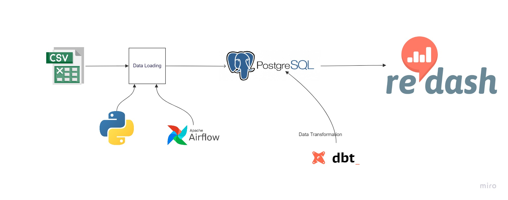

# Data-warehouse-tech-stack


<!-- TABLE OF CONTENTS -->
<details open="open">
  <summary>Table of Contents</summary>
  <ol>
    <li>
      <a href="#about-the-project">About The Project</a>
      <ul>
        <li><a href="#built-with">Built With</a></li>
      </ul>
    </li>
    <li>
      <a href="#getting-started">Getting Started</a>
      <ul>
        <li><a href="#prerequisites">Prerequisites</a></li>
        <li><a href="#installation">Installation</a></li>
      </ul>
    </li>
    <li><a href="#contributing">Contributing</a></li>
    <li><a href="#license">License</a></li>
    <li><a href="#contact">Contact</a></li>
    <li><a href="#acknowledgements">Acknowledgements</a></li>
  </ol>
</details>

<!-- ABOUT THE PROJECT -->
## About The Project

A dockerized Extract, Load, Transform (ELT) pipeline with PostgreSQL, Airflow, DBT, and a Redash.

### Built With

Tech Stack used in this project
* [![Docker][Docker.com]][Docker-url]
* [![Postgres][Postgresql.com]][Postgresql-url]
* [![Airflow][Airflow.com]][Airflow-url]
* [![DBT][DBT.com]][DBT-url]
* [![Redash][Redash.com]][Redash-url]

<!-- GETTING STARTED -->
## Getting Started
### Prerequisites
Make sure you have docker installed on local machine.
-   Docker
-   Docker Compose

### Installation

1. Clone the repo
    ```sh
    git clone https://github.com/skevin-dev/Data-warehouse-tech-stack
    ```
2. Navigate to the folder
    ```sh
    cd Data-warehouse-tech-stack
    ```

3. Run
    ```sh
     docker-compose up
    ```
5. Open Airflow web browser
    ```JS
    Navigate to `http://localhost:8089/` on the browser
    activate and trigger data_load
    activate and trigger dbt_airflow
    ```
6. Access redash dashboard
    ```JS
    Navigate to `http://localhost:5000/` on the browser
    ```


<!-- LICENSE -->
## License
Distributed under the MIT License. See `LICENSE` for more information.

<!-- CONTACT -->
## Contact
Kevin Shyaka - https://www.linkedin.com/in/shyaka-kevin/

<!-- ACKNOWLEDGMENTS -->
## Acknowledgments
-   [10 Academy](https://www.10academy.org/)


